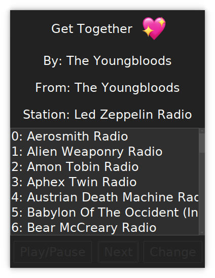

# Python Pianobar Wrapper

## The goal of this application is to furnish the user with a super snappy and lightweight GUI / systray application to control "Pianobar" player.

# Features:
- Pystray system tray
- ttkbootstrap for appealing UI
- Mediator design pattern
- Thread for systray
- Logging with colored formatting
- Love song support
- Media key controls (kb and headset)
- Media keys will work when playing video games!
- Change stations
- Play/Pause, next and change station support

# Usage:
Change these lines to your liking, run `python3 main.py` and enjoy!

    start(debug_on=False,
          app_icon="smile.png",
          app_name="Python Pianobar Wrapper",
          theme="darkly")

If you want a Desktop icon file, be sure to edit the one here in the repo
to fit your needs.

License: GPL Version 3.0 or Later

See the 'deps.txt' file for package requirements.

Tested on Ubuntu 23.10, 24.04

